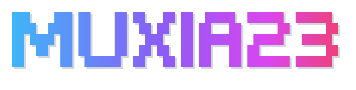

<picture>
  <source media="(prefers-color-scheme: dark)" srcset="assets/banner-dark.svg">
  
</picture>

<picture>
  <source media="(prefers-color-scheme: dark)" srcset="https://readme-typing-svg.demolab.com?font=Fira+Code&weight=500&size=20&pause=1400&color=A78BFA&center=true&vCenter=true&width=600&lines=Taste%20is%20a%20feature%2C%20not%20a%20luxury.;The%20best%20interface%20is%20the%20one%20you%20don%27t%20notice.;Stay%20curious.%20Keep%20shipping.;Pixels%20matter.">
  
</picture>

### 👋 About Me

- 🎓 Jinzhe Sun (孙金哲) · Software Engineering @ [Fuzhou University](https://www.fzu.edu.cn/), Class of 2028
- 📱 Building **Swift apps**, **WeChat Mini Programs** and **AI-powered applications**
- 💼 Former intern at **Ingenico**
- 📈 Into investing & prediction markets

### 🏆 Awards

- 🥇 **National 1st Prize** · Service Outsourcing Innovation & Entrepreneurship Competition 服务外包创新创业大赛
- 🥈 **National 2nd Prize** · China Collegiate Computing Design Contest 计算机设计大赛
- 🥈 **National 2nd Prize** · Cross-Strait Computer Innovation Works Contest 海峡两岸计算机创新作品赛
- 🥈 **National 2nd Prize** · International UX Innovation Competition 国际用户体验创新大赛
- 🏅 **Honorable Mention** · MCM/ICM 2025 美国大学生数学建模竞赛
- 🥈 **2nd Prize** · Electrician Cup Mathematical Modeling 电工杯数学建模
- 🥈 **Regional 2nd Prize** · Mobile App Innovation Contest 移动应用创新赛 · 华东赛区

### 🛠 Featured Projects

- [**AutoWritingBot**](https://github.com/muxia23/AutoWritingBot): AI-powered WeChat article generator with a multi-stage pipeline
- [**ricky-pixel-mod**](https://github.com/muxia23/ricky-pixel-mod): A pixel-art cat companion living in Claude Code
- [**pailixiang-downloader**](https://github.com/muxia23/pailixiang-downloader): Grab every original-resolution photo from a pailixiang album

### 📊 Languages

<picture>
  <source media="(prefers-color-scheme: dark)" srcset="https://github-readme-stats.vercel.app/api/top-langs/?username=muxia23&layout=compact&hide_border=true&langs_count=6&card_width=400&theme=github_dark">
  
</picture>

<picture>
  <source media="(prefers-color-scheme: dark)" srcset="https://raw.githubusercontent.com/muxia23/muxia23/output/github-contribution-grid-snake-dark.svg">
  
</picture>

